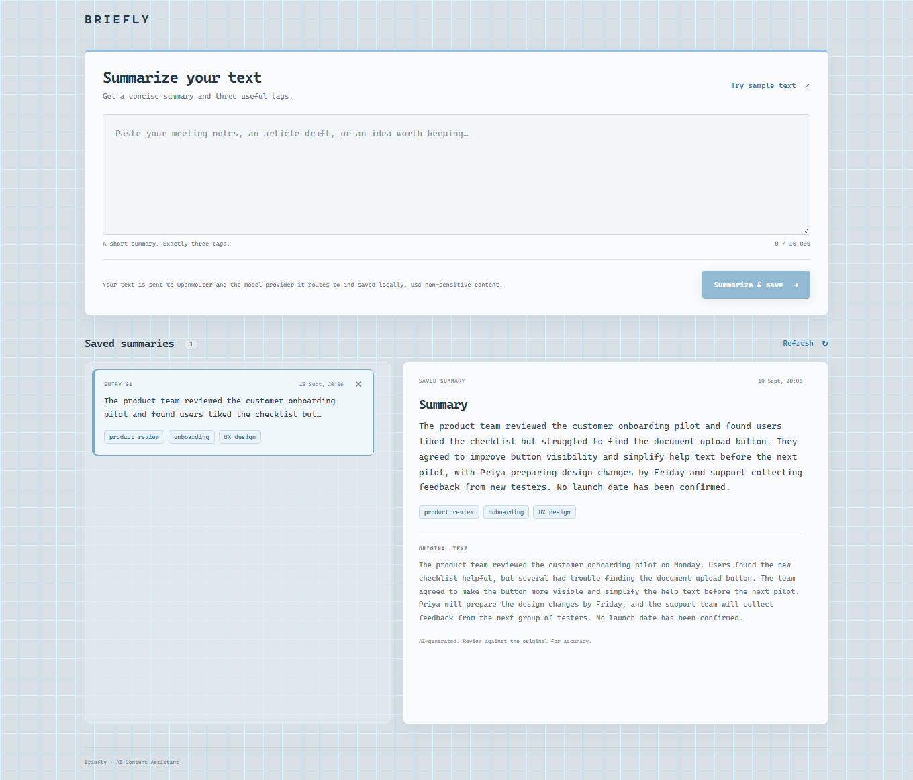

# Briefly — Small AI Content Assistant

React + Python/FastAPI + SQLite + interchangeable LLM providers (OpenRouter or direct Gemini). Submit text, get a concise summary and exactly three tags, and reopen saved originals.

## Run locally

Requires Python 3.11+ and Node.js 22.12+ (or 20.19+). From the repository root:

```powershell
python -m venv .venv
.venv\Scripts\python -m pip install -r backend/requirements.lock.txt
Copy-Item .env.example .env # First setup only; preserve an existing .env.
# Set OPENROUTER_API_KEY in .env, or in the backend's environment.
# LLM_PROVIDER defaults to openrouter; LLM_MODEL to deepseek/deepseek-v4-flash-0731.
.venv\Scripts\python -m uvicorn backend.main:app --host 127.0.0.1 --port 8000
```

In a second terminal:

```powershell
cd frontend
npm ci
npm run dev
```

Open **http://127.0.0.1:5173**. Click **Try sample text**, then **Summarize & save**, and open the saved entry. Backend API docs: **http://127.0.0.1:8000/docs**. On macOS/Linux use `.venv/bin/python` and `cp .env.example .env`.

SQLite is created automatically from `backend/schema.sql` at `data/entries.db`; restarting does not clear it. Optional server-only `DATABASE_PATH` selects another file. No credentials belong in frontend variables. `.env`, databases, and local test artifacts are ignored by Git. This unauthenticated prototype binds to localhost and should use synthetic content only.

**Switch providers:** set `LLM_PROVIDER=gemini`, `LLM_MODEL=gemini-2.5-flash-lite`, and `GEMINI_API_KEY`; restart the backend. For OpenRouter's free router, keep `LLM_PROVIDER=openrouter` and set `LLM_MODEL=openrouter/free`. Environment variables override `.env`. See [provider setup and extension](docs/providers.md) for model requirements and adding a vendor.

## Verify

```powershell
.venv\Scripts\python -m pytest backend/tests -q
cd frontend
npm run build
```

Tests replace only the provider HTTP transport; validation, routing, parsing, and file-backed SQLite are real. Browser verification and screenshot instructions are in `docs/verification.md`.

The lock file records the tested Python dependency set; `backend/requirements.txt` lists the direct dependency ranges.

**Verified 10 September 2026:** 32 backend tests, two browser tests, and the frontend build pass. The screenshot shows a fresh real OpenRouter/DeepSeek Flash submission, save, reload, and detail view. Tests also cover persistence across app instances, AI failure recovery, deletion, and scrolling. Direct Gemini is fixture-tested only. Details: [verification](docs/verification.md).



## 1. Architecture

React sends `POST /api/entries`; Vite proxies it to FastAPI `POST /entries`.
Pydantic validates text; a shared content service calls the configured provider adapter over HTTPS.
The adapter extracts output; the shared service validates it before committing one SQLite row.
`GET /entries?limit=20&offset=0` lists saved records; `GET /entries/{id}` loads details; `DELETE /entries/{id}` removes one saved summary.
Only committed entries appear in the UI; no database transaction spans the AI call.

## 2. AI choice

OpenRouter with `deepseek/deepseek-v4-flash-0731` uses existing credits and a lightweight model that supports JSON-schema structured output.
`LLM_PROVIDER` and `LLM_MODEL` select the adapter and model; direct Gemini remains available.
We request structured JSON and compatible routing, then validate locally; one live DeepSeek sample passed, not a broad quality benchmark.
References: [OpenRouter model](https://openrouter.ai/deepseek/deepseek-v4-flash-0731), [structured outputs](https://openrouter.ai/docs/guides/features/structured-outputs).

## 3. Reliability

One provider attempt has a 30-second total deadline; failures return safe 502/503/504 errors.
Invalid JSON, empty summaries, incomplete output, or anything other than three distinct nonblank tags is rejected.
Failures before persistence save nothing; the UI preserves the input. No automatic retries or fabricated fallback output.
If a browser response is lost, refresh the list before retrying: POST is not idempotent.

## 4. Privacy

Text, instructions, and schema go to OpenRouter and its routed provider, or Google when using direct Gemini; history is not sent.
The original, summary, and tags remain in local SQLite; application code does not log their contents.
Avoid customer identifiers, PAN/Aadhaar, account data, credentials, or confidential financial records.
Production needs approved provider terms, data minimization/redaction, access control, and retention rules.

## 5. Production next step

- Add authentication/entry ownership, approved data handling, redaction, and deletion/retention controls.
- Add idempotency and bounded rate limits/retries, with latency, failure, and token-cost metrics.
- Build a small quality evaluation set and move to PostgreSQL with migrations when concurrent usage warrants it.

## 6. AI coding tools

OpenAI Codex assisted with requirement analysis, implementation, tests, and documentation.
Generated code was reviewed for secret handling, prompt boundaries, SQL parameters, validation, and failure semantics.
Automated checks cover the API/provider boundary and persistence across app instances; the frontend is built and browser-tested.
A separate live browser check verified OpenRouter integration. Candidate walkthrough preparation is in `questions.md`.
